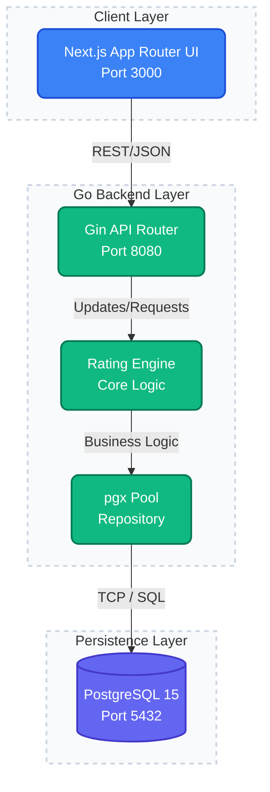

# 🚀 Contest Rating System

A comprehensive, percentile-based rating calculation platform built natively for real-time competitive programming ecosystems and massive multiplayer tournament platforms.

The engine features a high-performance HTTP calculator service paired with a Next.js App Router analytic dashboard spanning an interactive PostgreSQL transactional data-layer.

## 🛠️ Tech Stack
* **Backend:** Go 1.22, Gin Framework, pgx (connection pooling)
* **Frontend:** Next.js 14+ (App Router), TypeScript, Tailwind CSS, Recharts
* **Database:** PostgreSQL 15, golang-migrate
* **Infrastructure:** Docker, docker-compose multi-stage automated builds

## 🏗️ Architecture Diagram



## 💻 How to Run

### Method 1: Docker (Recommended)
You can run the entire decoupled stack synchronously via Docker setup without needing NextJS, Go, or Postgres natively installed.

1. Clone the repository natively.
2. Initialize environment parameters:
   ```bash
   cp .env.example .env
   ```
3. Spin up the orchestrator:
   ```bash
   docker compose up --build
   ```
4. Access the stack:
   - **Frontend UI Layer:** `https://contest-rating-system-beige.vercel.app`
   - **Backend API Layer:** `https://contest-rating-system-o84v.onrender.com`

### Method 2: Local Development
If you prefer running services outside of Docker for debugging/modding:

**1. Database Instance:**
Ensure PostgreSQL is available through the `DATABASE_URL` value in your environment.

**2. Backend:**
```bash
cd backend
go mod tidy
migrate -path migrations -database "$DATABASE_URL" up
go run cmd/main.go
```

**3. Frontend:**
```bash
cd frontend
npm install
npm run dev
```

## 🔌 API Endpoints

| HTTP Method | Endpoint | Description |
| :--- | :--- | :--- |
| `GET` | `/health` | Application status validation |
| `POST` | `/api/users` | Initialize a new user profile starting at 1500 (Master) |
| `POST` | `/api/contests` | Create a pending contest module event |
| `POST` | `/api/contests/:id/submit-results` | Computes entire bracket algorithm array via `{user_id, rank}` JSON payload arrays |
| `GET` | `/api/users/:id/profile` | Fetches consolidated participant user stats and their chronological contest progression payloads limits |

## 🧠 Rating Execution Logic Explanation
The core logic runs statically independent of the DB, parsing input rank sets against theoretical percentile models.

1. **Percentile Calculation:** `beaten = total_participants - rank` -> `Percentile = beaten / total_participants`.
2. **Determine Standard Performance:** Maps the float percentile to a guaranteed arbitrary ELO baseline integer:
    - Top 1%: 1800
    - Top 5%: 1400
    - Top 10%: 1200
    - Top 20%: 1150
    - Top 30%: 1100
    - Top 50%: 1000
    - Bottom <50%: 800
3. **Fluctuation Delta:** Calculates the true `rating_change` taking the absolute center difference:  `(Standard Performance - Current Rating) / 2`.
4. **Automated Tier Assignment:**
    - `< 1000`: Newbie 
    - `1000 - 1199`: Pupil
    - `1200 - 1399`: Specialist
    - `1400 - 1599`: Expert
    - `1600 - 1799`: Master
    - `>= 1800`: Grandmaster

## ⚙️ Environment Variables
Defined within the root `.env` module loaded hierarchically into your Go instance and docker pipelines:

| Variable | Description | Default Example |
| :--- | :--- | :--- |
| `DB_USER` | Target database user credentials flag | `postgres` |
| `DB_PASSWORD` | External containerized pg passkey | `secretpassword` |
| `DB_NAME` | Assigned initial DB Table map instantiation | `contest_engine` |
| `DATABASE_URL` | Deployed PostgreSQL connection string used by the backend | `your-deployed-postgres-connection-string` |
| `BACKEND_PORT` | Main execution bind | `8080` |
| `FRONTEND_PORT` | Node App Router compilation host | `3000` |
| `NEXT_PUBLIC_API_URL` | Frontend API base URL | `https://contest-rating-system-o84v.onrender.com` |
| `CORS_ALLOWED_ORIGINS` | Allowed frontend origin(s) for the backend | `https://contest-rating-system-beige.vercel.app` |

## 📁 Folder Structure

```text
├── backend/
│   ├── cmd/main.go              # Main Entrypoint initialization
│   ├── internal/
│   │   ├── handler/             # API request payload controllers
│   │   ├── repository/          # Data Access queries (pgx)
│   │   └── service/             # Pure Core rating logic unit tests
│   ├── migrations/              # golang-migrate raw upstream SQL
│   └── Dockerfile               # Alpine Go Multi-Stage compiler
├── frontend/
│   ├── app/profile/[userId]/    # Server-Component Profile Screen
│   ├── components/              # UI Render blocks (TierBadge, Recharts)
│   ├── lib/api.ts               # Axios Client Fetchers + TS Types
│   ├── next.config.ts           # Standalone production output enabled
│   └── Dockerfile               # Next.js Node20 Slim-Layer builder
├── docker-compose.yml           # Unified Orchestration network mapping
└── .env.example                 # Config blueprint
```
